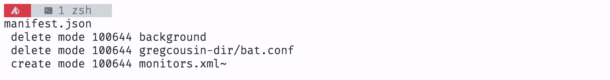

# xotomachine-tmuxtheme

A clean, light Tmux theme that celebrates the lights 

### Installation using TPM

In your `tmux.conf`:
```
set -g @plugin "xotomachine/xotomachine-tmuxtheme"
```

### Snapshots

##### New tokyonight

Terminal: Ala
Fonts:
  - SF Mono
  - MesloLGLDZ Nerd Font Mono
  - Noto Sans Mono CJK JP
  - Symbola


